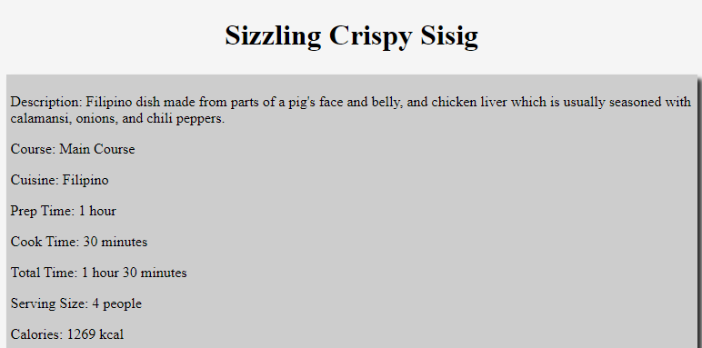
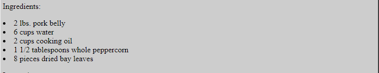
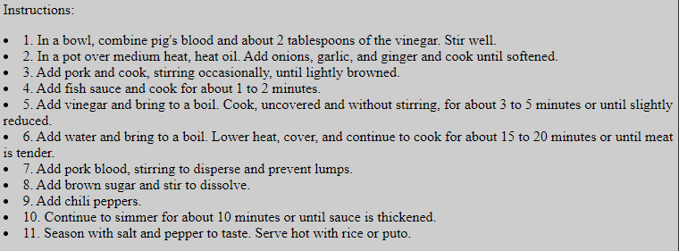
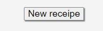

# Random-meal-generator

# description
This is a random filipino meal generator, whenever you load it up it will randomly generate out of 21 meals.
I used mostly basic css and vanilla javascript to try and improve and define my skills. Some features that
i would like to add is a page before the random meal pops up and the page has a button that you can click that will take
you to the random meal.

# instructions
when you load up the website [page](https://drewpayton.github.io/Random-meal-generator/) you will get a random meal.

First you see the name of the dish and the description of the dish with
all the main information you'll need.

Next will show you the ingredients of the the dish so you will know 
what you need in order to cook the dish.

Next are the instructions, you will follow these instructions in order to cook the meal.

Then you will come across a video with a more in depth guide to cook the 
random meal you choose to cook.

Last but not least there will be a button at the bottom of the page and if you click it, it will give you a new random recipe but first it will pop open a little window to make sure you want to really go to another recipe or that was on accident.

 